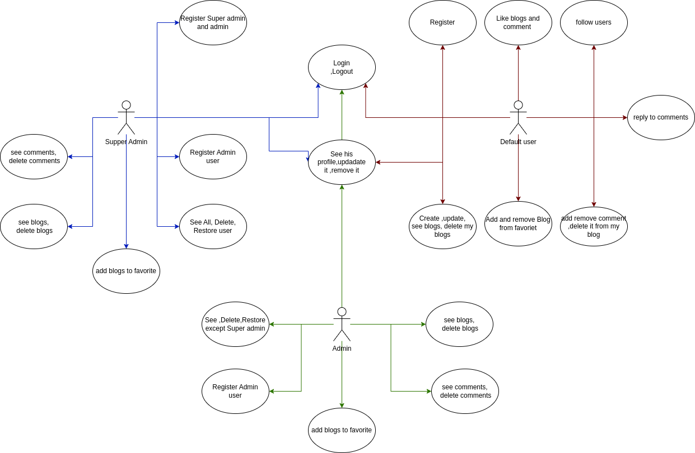
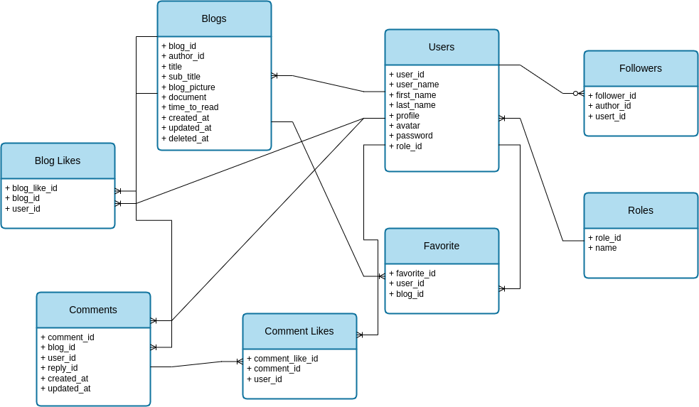

# Blog Post V1 back

welcome to blog post backend
in this project we have create the backend for A blog post where you can

1. create account for users (wheather they are admin, super admin or visiter)
2. post a blog
3. comment on a blog
4. interact with blog wheather by saving it or by giving it a like
5. interact with other user by following them

## use case diagram

## database ERD

## technology used

We have used in this project :

- [Node js](https://nodejs.org/dist/latest-v18.x/docs/api/documentation.html) version 18.16.0 with the framwork [nest.js](https://docs.nestjs.com/)
- [typeorm](https://typeorm.io/) as ORM to interact with [Mysql database](https://dev.mysql.com/doc/)
- and for the auth we use [Passport](https://www.passportjs.org/docs/) session and store it in [redis database](https://redis.io/)
- and for the authorization we used [CASL](https://casl.js.org/v6/en/guide/intro) because we had roles for user
- and finally for validating the comming request we used [class validator](https://github.com/typestack/class-validator#validation-decorators)

## setting up

before you start make sure you have

- node js, you can check that using `node -v`
- mysql database running on your device
- redis database running on your device

now to start you should :

- run `npm i` to install the required library
- rename .env.sample to .env and set up your database credential and add your own session secret
- now to create the mysql database run `npm run db:create` to create the database with the name of the .env variable `DB_NAME_DEVELOPMENT` and to drop it run `npm run db:drop`
- and finally run `npm run start:dev` and the server will run on `http://localhost:4000/`
- if you are using [vs code](https://code.visualstudio.com/) you can download the [thunder client](https://code.visualstudio.com/) and import the thunder collection inside the `extra/thunder-collection_blog_post_v1.json` to see the request collection
